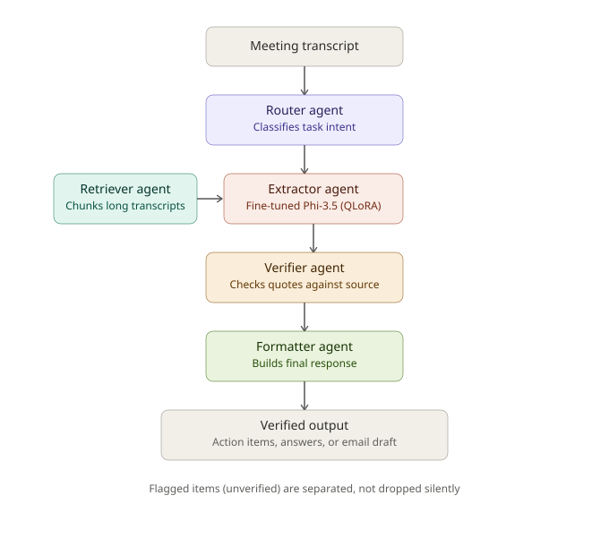

# Meeting Copilot

A fine-tuned LLM + multi-agent pipeline that turns raw meeting transcripts into structured action items, grounded Q&A, and follow-up email drafts — with an automated LLM-judge evaluation harness measuring every design decision along the way.

Built as a portfolio project targeting Applied Scientist roles (LLM fine-tuning, multi-agent systems, automated evaluation pipelines) — the domain mirrors BizChat/Office/Teams Copilot use cases directly.

## Architecture



A transcript is routed to the right task, optionally chunked by the Retriever for long meetings, processed by a fine-tuned model, then every claimed action item is checked against the source transcript by the Verifier before being formatted into the final response. Unverified items are flagged and surfaced separately rather than silently dropped or silently kept — this is the hallucination guard, and it's the single most interview-relevant piece of the system.

## Results


Fine-tuning a QLoRA adapter (rank 16, 3 epochs, 250 synthetic instruction examples) on top of Phi-3.5-mini improved:
- **Correctness**: 3.07 → 4.14 (+35%)
- **Completeness**: 2.86 → 3.64 (+27%)
- **Groundedness**: 4.64 → 4.57 (roughly flat — expected, since groundedness is primarily enforced by the Verifier agent rather than the base model's generation quality)

Scored by an LLM judge (Azure GPT-4.1) on 7 held-out transcripts never seen during training.

## Project structure

```
meeting-copilot/
├── data_generated/       # synthetic meeting transcripts + gold labels (train/val/held-out eval)
├── training/
│   ├── train_qlora.py    # QLoRA fine-tuning (Colab/Kaggle GPU)
│   └── inference.py      # model wrapper — local fine-tuned checkpoint or API fallback (Anthropic/OpenAI/Azure)
├── agents/
│   └── orchestrator.py   # Router → Retriever → Extractor → Verifier → Formatter
├── eval/
│   ├── judge.py          # LLM-as-judge scoring + human-label correlation
│   └── eval_runner.py    # end-to-end: runs the pipeline + judge, builds the comparison table
├── demo/
│   └── app.py            # Gradio demo
└── assets/                # architecture diagram, result charts
```

## How it works

1. **Data**: 60 synthetic meeting transcripts (6 meeting types, 2–6 participants, deliberate negative cases — meetings with zero action items, ambiguous ownership, unanswerable questions) generated programmatically for speed and determinism given a tight build timeline. See `data_generated/README.md` for the honest breakdown of this tradeoff and the upgrade path to LLM-generated transcripts.

2. **Fine-tuning**: QLoRA on Phi-3.5-mini-instruct, instruction-tuned across three task types (extraction, Q&A, email drafting) derived from the same transcripts.

3. **Multi-agent pipeline**: hand-rolled orchestration (not a framework) so every failure mode is visible and explainable — retry-on-malformed-JSON, hallucination verification against source quotes, graceful degradation when the model can't produce valid output.

4. **Evaluation**: an LLM judge scores every pipeline output on correctness, groundedness, and completeness, validated against a small hand-labeled gold set kept separate from training data throughout.

## What I'd do with more time

- Real (not templated) transcripts, generated by an LLM and spot-checked, for more natural linguistic variety
- A DPO pass specifically targeting hallucination suppression, using pairs of grounded vs. fabricated action-item extractions
- Complete the rank-sweep (r=8/16/32) and data-scale (n=50/150/250) ablations — infrastructure is built (`train_qlora.py --lora_r`, `--train_subset`), interrupted by GPU session limits during the build
- A larger held-out eval set (currently 7 transcripts) for tighter confidence intervals on the judge scores
- Human-in-the-loop review UI for flagged/unverified action items

## Running it

See inline docstrings in each script for exact commands. Quick start for the demo:

```bash
pip install openai gradio scipy
export AZURE_OPENAI_ENDPOINT="https://your-resource.openai.azure.com"
export AZURE_OPENAI_API_KEY="your-key"
cd demo && python app.py
```
